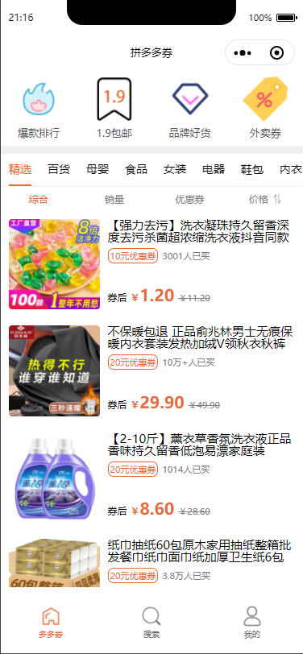

# pdd-coupon

### 券多省钱通 —— 拼多多领券小程序（多多金宝）




### 使用方法

`该小程序使用微信原生+云函数开发。`

* 申请多多进宝应用，不做详细叙述，申请地址：[https://jinbao.pinduoduo.com/](https://jinbao.pinduoduo.com/)、[https://open.pinduoduo.com/](https://open.pinduoduo.com/)
* 在微信开发者工具中导入项目`wechat-xcx`文件夹，并开启云开发。
* 修改`env.js`的配置。
* 修改`functions\pquery\pdd\utils.js`里拼多多相关的配置参数。上传云函数。

### 其他问题

* 如果遇到领券 搜索接口报错，需要用这个接口[https://jinbao.pinduoduo.com/third-party/api-detail?apiName=pdd.ddk.rp.prom.url.generate](https://jinbao.pinduoduo.com/third-party/api-detail?apiName=pdd.ddk.rp.prom.url.generate)对`pid`备案一次，channel_type: 10。接口会返回以下格式的参数：

```json
{"rp_promotion_url_generate_response":{"url_list":[{"mobile_url":"xxxxx","url":"xxxx"}],"request_id":"xxx"}}
```
登录上述的url，用你的账号授权一次。用该接口[https://jinbao.pinduoduo.com/third-party/api-detail?apiName=pdd.ddk.member.authority.query](https://jinbao.pinduoduo.com/third-party/api-detail?apiName=pdd.ddk.member.authority.query)查询下是否备案成功，成功后就没权限问题。

### 已上线案例：

  


如有疑问，请提issue或微信联系：sgxiang（无编程经验者勿扰或付费咨询。有编程经验值请先查阅云开发相关的文章以及上面的其他问题，如果还有疑问再咨询。）
